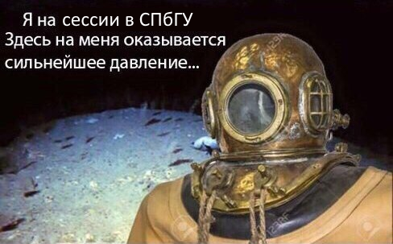

# Перечислите идеи и коротко обозначьте мысли которые у вас возникали по мере выполнения задания, в частности попробуйте ответить на вопросы:

### 1) Зачем фильтровать матчи, если потом мы запускаем устойчивый к выбросам RANSAC и отфильтровываем шумные сопоставления?

Во-первых, кажется, что фильтрация банально быстрее работает.
И благодаря ей получается уменьшить количество итераций RANSAC, потому что мы выкидываем условно-случайный шум.

### 2) Cluster filtering довольно хорошо работает и без Ratio test. Однако, если оставить только Cluster filtering, некоторые тесты начнут падать. Почему так происходит? В каких случаях наоборот, не хватает Ratio test и необходима дополнительная фильтрация?

Перед использованием Ratio-теста у нас очень много мусорных мэтчей.
Эти мусорные мэтчи, очевидно, далеко не всегда двигаются кластерами,
а ещё засоряют рассматриваемых соседей у правильных мэтчей, из-за чего правильный мэтч может не прости CF.

### 3) С какой проблемой можно столкнуться при приравнивании единице элемента H33 матрицы гомографии? Как ее решить?

Мы живем в предположении H33 = 1 для однозначности, ибо мы, по сути, можем всё на H33 поделить.
Но тогда проблемы возникают в матрицах, где H33 = 0.
Это мы обсуждали на лкеции, и там говорилось, что можно использовать SVD.

### 4) Какой подвох таится в попытке склеивать большие панорамы и ортофото методом, реализованным в данной домашке? (Для интуиции можно посмотреть на результат склейки, когда за корень взята какая-нибудь другая картинка)

У нас все наши вычисления и склейки обладают неточностями. И если для одного-двух слоёв-склеек эти неточности терпимы,
то для склейки-бамбука неточности будут накладываться друг на друга и становиться куда больше.

### 5) Как можно автоматически построить граф для построения панорамы, чтобы на вход метод принимал только список картинок?

Если определить вес ребра, как "хорошесть" сопоставления картинок (например, количество мэтчей?),
то можно построить максимальное остовное дерево, а корень выбрать, чтобы его глубина была минимальной
(чтобы приколы из предыдущего вопроса были менее вероятны).

### 6) и 7)

Учёба убивает.