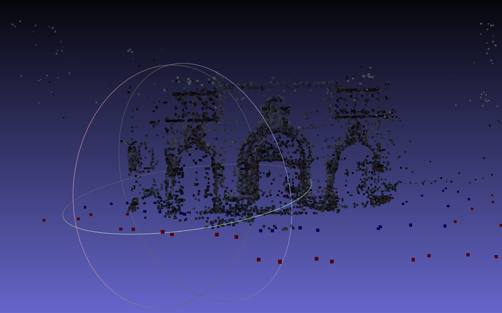

// Убедитесь что название PR соответствует шаблону:
// Task04 <Имя> <Фамилия> <ВУЗ>

// Проверьте что обе ветки PR - task04 (отправляемая из вашего форкнутого репозитория и та в которую вы отправляете PR)

# Перечислите идеи и коротко обозначьте мысли которые у вас возникали по мере выполнения задания, в частности попробуйте ответить на вопросы:

1) test_ceres_solver/FitLine: почему найденная прямая и эталонная - не совпадают? Как это исправить пост-обработкой? Как это исправить формулировкой задачи?

- пост-обработкой -- например, отнормировать вектор, задающий прямую
- формулировкой -- зафиксировать b = 1 и искать прямую в виде y = kx + t

2) BA: представьте что вы написали преобразование phg::Calibration -> блок параметров и обратное блок параметров -> phg::Calibration. Как проверить простым образом что эти преобразования сделаны корректно? Что должно быть в логе про процент inliers до/после BA если runBA() вызывать всегда два раза пордяд? Иначе говоря - что следует из того что в идеале runBA() должна быть (мне очень нравится это слово) - [идемпотентна](https://ru.wikipedia.org/wiki/%D0%98%D0%B4%D0%B5%D0%BC%D0%BF%D0%BE%D1%82%D0%B5%D0%BD%D1%82%D0%BD%D0%BE%D1%81%D1%82%D1%8C)?

- эти преобразования в композиции должны давать id (собственно, я использовал это для отладки кода)

3) Какое максимальное число кадров у вас получилось хорошо выравнять для каждого из датасетов? (проверьте хотя бы saharov32 и herzjesu25) Не забудьте приложить скриншоты.
- все из saharov и herjesu
- 
- 

4) Если бы вычисления в double были абсолютно точны - можно ли было бы назвать вычисления в Calibration::project/unproject строго зеркальными? 
- Нет, там возникает уравнение большой степени на $r = x^2 + y^2$ при аналитическом расписывании, которое не разрешимо в общем случае.

5) Почему фокальная длина меняется от того что мы уменьшаем картинку? Почему именно f/downscale?
- Потому что прямые, проходящие через трехмерную точку и ее образ в камере, пересекаются в точках в downscale раз ближе в случае уменьшения картинки в два раза с сохранением центра, что соответствует уменьшению фокальной длины в downscale раз

6) Имеет ли право BA двигать точку отсчета системы координат (т.е. добавить константу ко всем координатам)? Как это повлияет на суммарную Loss?
- при сдвигу точки при условии, что хотя бы две главных оптических оси не параллельны, лосс увеличится, потому что хотя бы на на одной или на обеих из камер с параллельными оптическими осями проекции точек станут дальше от оптимального пересечения.

7) Каким образом можно гарантировать чтобы при сравнении нескольких последовательно построенных облаков точек одного и того же датасета (созданных по мере добавления фотографии за фотографией) в MeshLab - облака не были хаотично смещены/отмасштабированы/повернуты друг от друга?
- оно уже сейчас гарантируется bundle adjustment - если очередное добавленное облако будет неправильно повернуто относительно правильного, то на общих точка уже имеющегося облака и заматченных точек с новой камеры будет большой лосс, ибо он не может быть маленьким при плохом соотношении камеры 

100) Если есть - фидбек/идеи по улучшению задания.

// Создайте PR.
// Дождитесь отработки Travis CI, после чего нажмите на зеленую галочку -> Details -> The build -> скопируйте весь лог тестирования.
// Откройте PR на редактирование (сверху справа три точки->Edit) и добавьте сюда скопированный лог тестирования внутри тега <pre> для сохранения форматирования и под спойлером для компактности и удобства:

Travis CI

<pre>
$ ./build/test_ceres_solver
...
$ ./build/test_sfm_ba
...
</pre>

